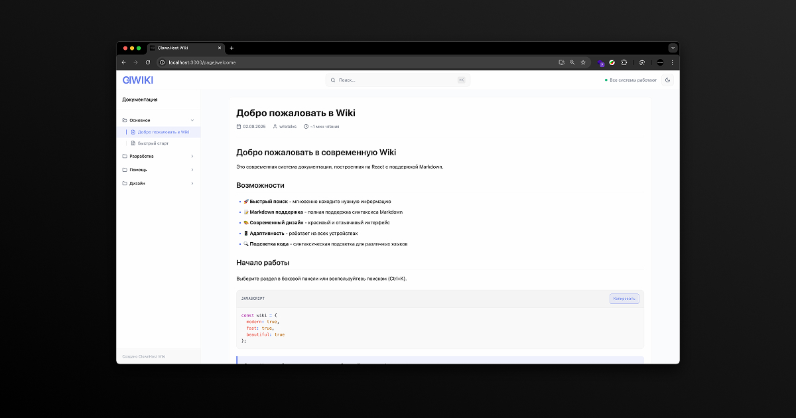
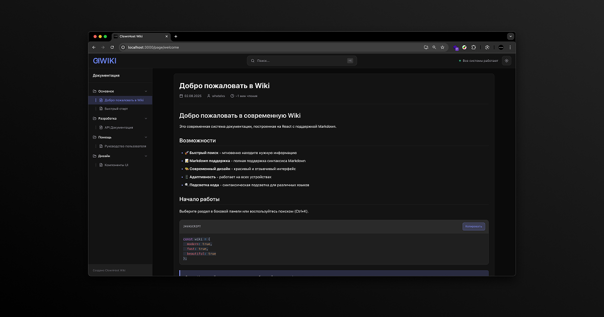
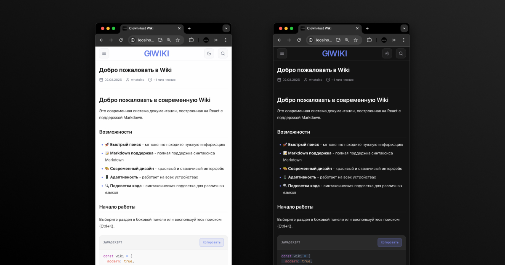

# ClownHost Wiki 📚

Современная система документации на React с полной поддержкой Markdown, роутингом и красивым адаптивным дизайном.


## ✨ Возможности

- 🚀 **Быстрый поиск** - мгновенный поиск по всей документации (Ctrl+K)
- 📝 **Markdown файлы** - контент хранится в отдельных `.md` файлах
- 🔗 **URL роутинг** - каждая страница имеет уникальный URL для шаринга
- 🎨 **Современный дизайн** - красивый и отзывчивый интерфейс
- 📱 **Мобильная адаптация** - оптимизирован для всех устройств
- 📋 **Копирование кода** - кнопка копирования с анимацией для блоков кода
- 🔍 **Подсветка синтаксиса** - поддержка множества языков программирования
- ⚡ **Горячие клавиши** - быстрая навигация с клавиатуры
- 🌳 **Древовидная навигация** - автоматическая организация по категориям
- 🖼 **Галерея изображений** - встроенная поддержка изображений с подписями
- 🔄 **Автозагрузка контента** - асинхронная загрузка markdown файлов

## 💻 Скриншоты проекта






## 🚀 Быстрый старт

### Установка зависимостей
```bash
npm install
```

### Запуск в режиме разработки
```bash
npm start
```

Приложение откроется в браузере по адресу [http://localhost:3000](http://localhost:3000)

### Сборка для продакшена
```bash
npm run build
```

## 📖 Добавление контента

### Структура контента
Контент хранится в виде отдельных Markdown файлов в папке `public/content/`:

```
public/content/
├── welcome.md          # Главная страница
├── getting-started.md  # Руководство по началу работы
├── user-guide.md       # Пользовательское руководство
├── api-docs.md         # API документация
└── ui-components.md    # UI компоненты
```

### Метаданные страниц
Метаданные страниц определяются в `src/data/wikiData.js`:

```javascript
{
  id: 1,
  title: 'Название страницы',
  slug: 'page-slug',           // URL slug для роутинга
  category: 'Категория',       // Группировка в сайдбаре
  filename: 'page-slug.md',    // Имя markdown файла
  lastModified: '2024-12-23',
  author: 'Автор',
  description: 'Краткое описание страницы'
}
```

### Создание новой страницы

1. **Создайте markdown файл** в `public/content/`:

2. **Добавьте метаданные** в `src/data/wikiData.js`:
```javascript
export const wikiMetadata = [
  // ... существующие страницы
  {
    id: 6,
    title: 'Новая страница',
    slug: 'new-page',
    category: 'Руководства',
    filename: 'new-page.md',
    lastModified: '2024-12-23',
    author: 'Ваше имя',
    description: 'Описание новой страницы'
  }
];
```

### Поддерживаемый Markdown

- **Заголовки** - H1-H6 с автоматическими якорями
- **Списки** - маркированные и нумерованные  
- **Ссылки** - внутренние и внешние (с иконкой)
- **Изображения** - с подписями и адаптивным размером
- **Таблицы** - с адаптивным горизонтальным скроллом
- **Код** - инлайн и блоки с подсветкой синтаксиса
- **Цитаты** - с красивым оформлением
- **Текст** - жирный, курсивный, зачеркнутый
- **GitHub Flavored Markdown** - чекбоксы, таблицы, автолинки

## 📄 Лицензия

Проект распространяется под лицензией MIT — свободно используйте и модифицируйте, но обязательно сохраняйте указание авторства и ссылку на исходный репозиторий, как на open source проект.
